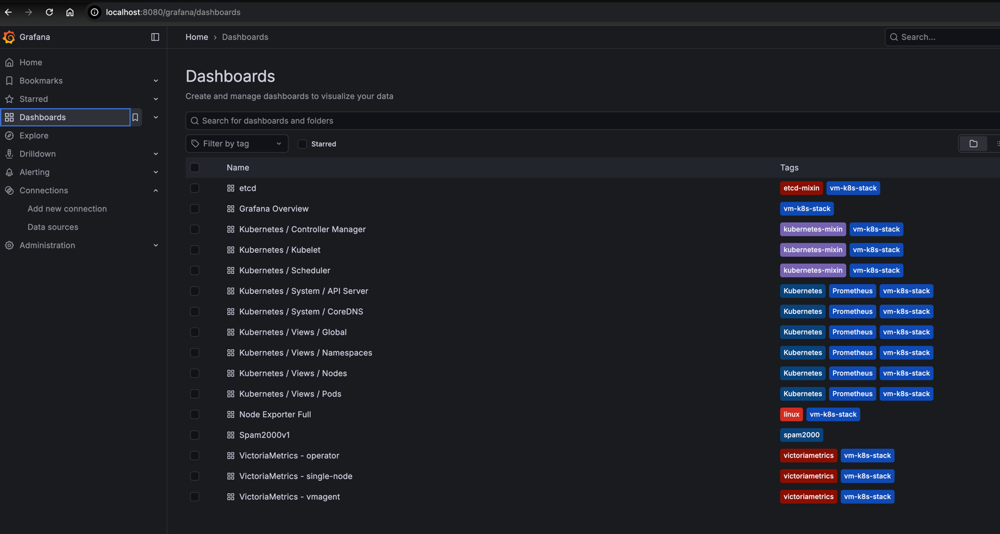
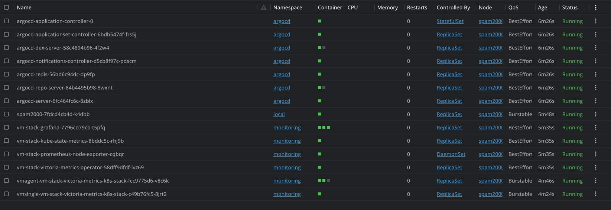
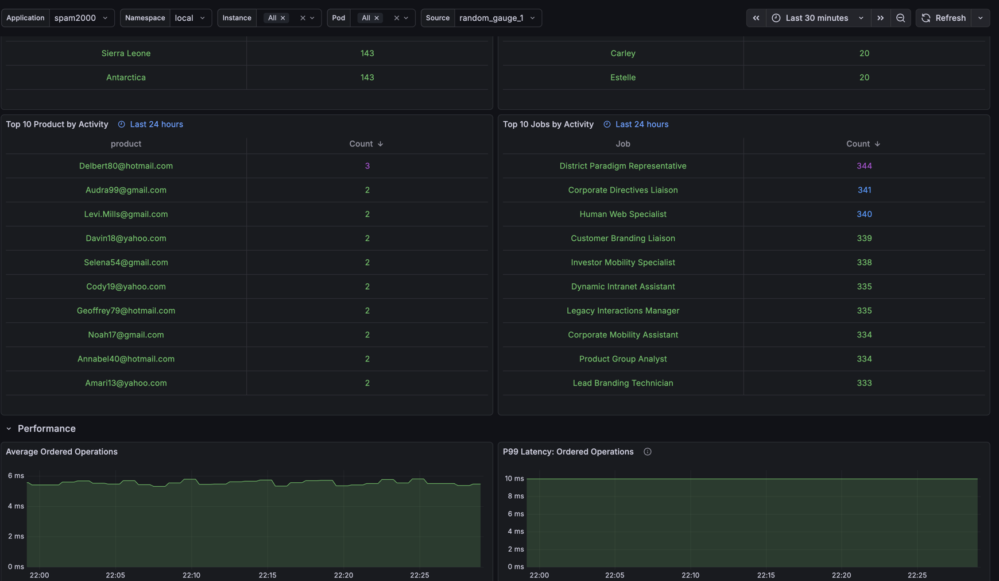

# Spam2000 GitOps & Monitoring Stack

This repository contains a fully automated GitOps environment deployed on Minikube. It provisions a Kubernetes cluster, installs ArgoCD for continuous delivery, and sets up VictoriaMetrics with Grafana for observability.

## Prerequisites
Before running the stack, ensure you have the following installed and available:
* **Docker**: Used as the driver for Minikube.
* **Terraform**: Version v1.14.4 recommended.
* **6GB Ram**
* **4 vCPU**

## Quick Start (One Command)
To deploy everything run the command bellow from root dir of the project:
```shell
cd terraform && chmod +x bootstrap.sh && ./bootstrap.sh
```

## Cleanup
Terraform destroy will delete your entire Minikube cluster and all managed resources. Use with caution. Run the following command from the root dir of the project.
```shell
cd terraform && terraform destroy -var-file="local.tfvars" -auto-approve
```

## Resources Created
* Minikube Cluster: Named spam2000 with 6GB RAM.
* ArgoCD Stack: Installed in the argocd namespace for GitOps.
* VictoriaMetrics Monitoring: Installed in the monitoring namespace, including Grafana.
* ArgoCD Root Application: Configured to track and deploy resources from the applications path of this repo.
* Custom Dashboard: A pre-configured dashboard (Spam2000v1) for the spam2000 application is automatically added to Grafana via ArgoCD.
* Spam2000 Application: is deployed automatically via ArgoCD.

## URLs to Check
* ArgoCD: http://localhost:8080/argocd

* Grafana: http://localhost:8080/grafana

* Spam2000: http://localhost:8080

## Important Notes
* Minikube Driver: This stack was developed and tested using the Docker driver on Minikube.
* Hardware Requirements: It is highly recommended to keep 6GB or higher to ensure the monitoring stack runs smoothly.
* You need to wait some time so that necessary data points get scraped by vmagent to see charts
* The infrastructure is deployed using local.tfvars file within terraform directory
* Updating spam2000 Chart should trigger auto update via ArgoCD.

## Appendix
Here is some screenshots to confirm that the infrastructure is working



